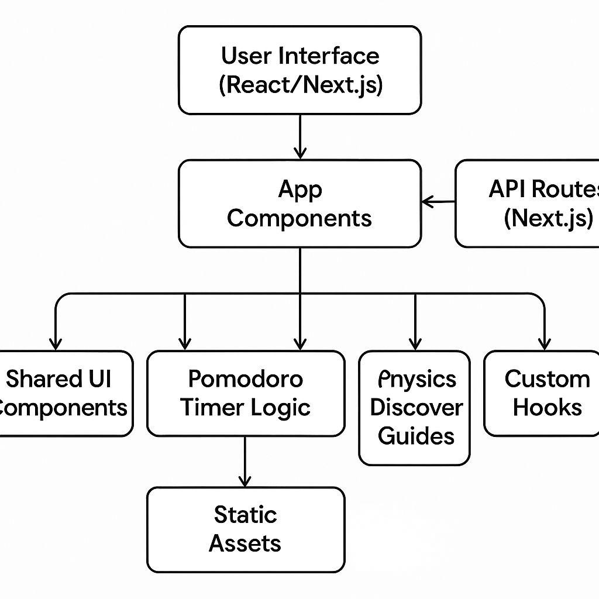

# Kanada

Kanada is a productivity and research web application designed to help users focus, learn, and discover.  
**Version 1** features a Pomodoro timer and advanced search powered by Brave Search and Gemini AI.

---

## Features

- **Pomodoro Timer:**  
  Stay productive with a built-in Pomodoro timer and customizable settings (rain & lofi background music).

- **Brave Search Integration:**  
  Search the web, images, and videos using the Brave Search API.

- **Gemini AI Summaries:**  
  Get AI-generated summaries and answers for your search queries.

- **Discover Physics:**  
  Explore curated physics topics and resources.

---

## Project Structure

```
kanada/
├── app/
│   ├── _components/           # Shared React components (Pomodoro, Sidebar, etc.)
│   ├── (routes)/              # Route-specific components and pages
│   │   └── search/            # Search feature and API endpoints
│   ├── api/                   # API route handlers (Brave, Gemini, etc.)
│   ├── discover/              # Physics discovery pages
│   ├── library/               # Library/resource pages
│   └── pomodoro/              # Pomodoro timer page
├── components/                # UI primitives (buttons, cards, etc.)
├── hooks/                     # Custom React hooks
├── inngest/                   # Background jobs and event functions
├── lib/                       # Utility functions
├── public/                    # Static assets (images, audio)
├── services/                  # Shared service logic
├── next.config.mjs            # Next.js configuration
├── package.json               # Project metadata and scripts
└── README.md                  # Project documentation
```

---

## Architecture Diagram



---

## Roadmap

### Version 2 (Coming Soon)
- User Login/Signup
- Mobile-friendly responsive design
- Improved AI answers and summaries
- More physics discovery guides and resources

---


*Made with ❤️ for Physics <3